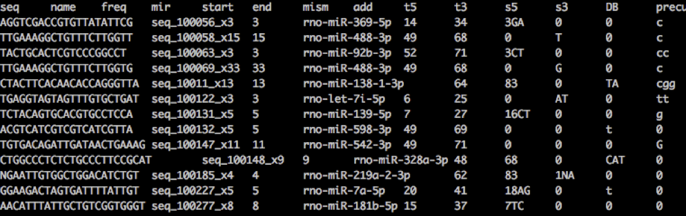

mirtop
---------

   

Command line tool to annotate with a standard naming miRNAs e isomiRs.

See more at: [isomiRs naming discussion](https://github.com/miRTop/incubator/blob/master/isomirs/isomir_naming.md)

Cite
---------

http://mirtop.github.io

Installation
------------
Thes best solution is to install conda to get an independent enviroment.

`wget http://repo.continuum.io/miniconda/Miniconda-latest-Linux-x86_64.sh`

`bash Miniconda-latest-Linux-x86_64.sh -b -p ~/mirtop_env`

`export PATH=$PATH:~/mirtop_env`

`git clone http://github.com/miRTop/mirtop`

`cd mirtop`

`python setup.py develop`

Quick start
-----------

`cd data`
`mirtop annotate --sps hsa --hairpin examples/annotate/hairpin.fa --mirna examples/annotate/miRNA.str -o test_out_mirs_fasta examples/annotate/sim_isomir.fa`

Output
------

There will be a `*.mirna` file that is a tabular file with this format:

Naming of isomiRs follow these rules:

* Changes at 5' end: ``0/NA`` means no modification. ``UPPER CASE LETTER`` means nucleotide insertions (sequence starts before miRBase mature position). ``LOWWER CASE LETTER`` means nucleotide deletions (sequence starts after miRBase mature position).
* Changes at 3' end: ``0/NA`` means no modification. ``UPPER CASE LETTER`` means nucleotide insertions (sequence ends after miRBase mature position). ``LOWWER CASE LETTER`` means nucleotide deletions (sequence ends before miRBase mature position).
* Additions at 3' end: ``0/NA`` means no modification. ``UPPER CASE LETTER`` means addition at the end. Note these nucleotides don't match the precursor. So they are post-transcriptional modification.
* Nucleotide substitution: ``NUMBER|NUCLEOTIDE_ISOMIR|NUCLEOTIDE_REFERENCE`` means at the position giving by the number the nucleotide in the sequence has substituted the nucleotide in the reference. This, as well, is a post-transcriptional modification.

There are two different outputs right now: 1) tab limited format, where each column will refer to the previous 4 points, or 2) a merged format, where these 4 points (mirna, substitution, addition, 5 trimming, 3 trimming) are separated by ``:``. For instance: ``hsa-let-7a-5p:0:0:GT:t`` means ``hsa-let-7a-5p`` has a 5' trimming event (starts 2 nts before the reference miRNA) and a 3' trimming event (ends 1 nt before the reference miRNA).

Use [isomiRs R package for the analysis](http://bioconductor.org/packages/3.5/bioc/html/isomiRs.html)

Contributors
------------

* [Lorena Pantano](https://github.com/lpantano) (Bioinformatic Core, Harvard Chan School, Boston, USA)

